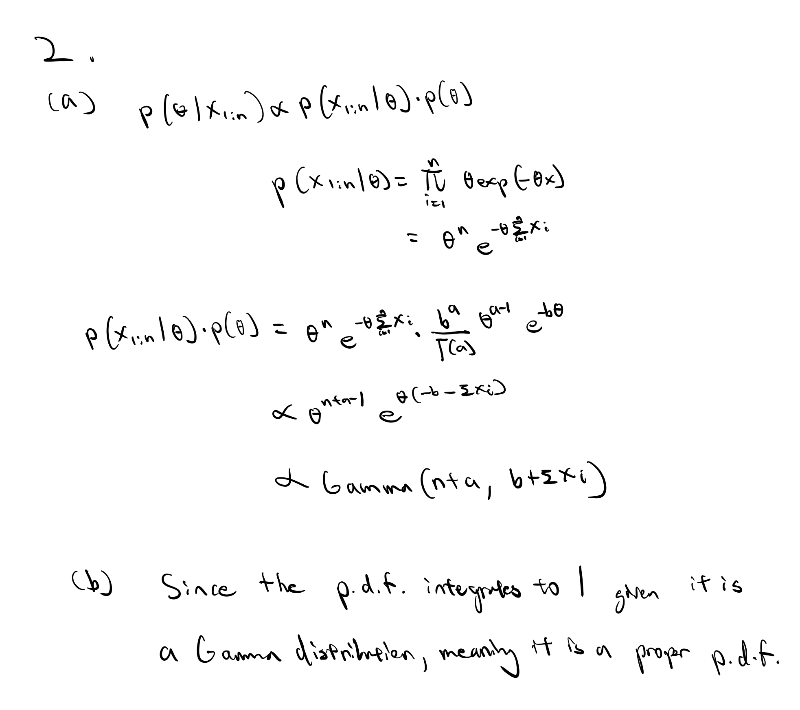
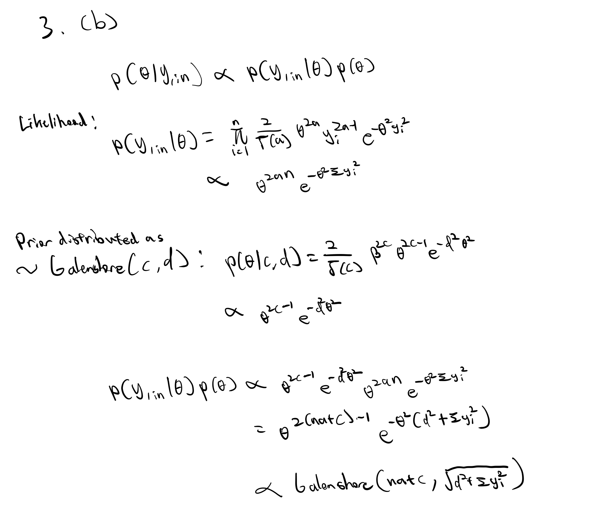
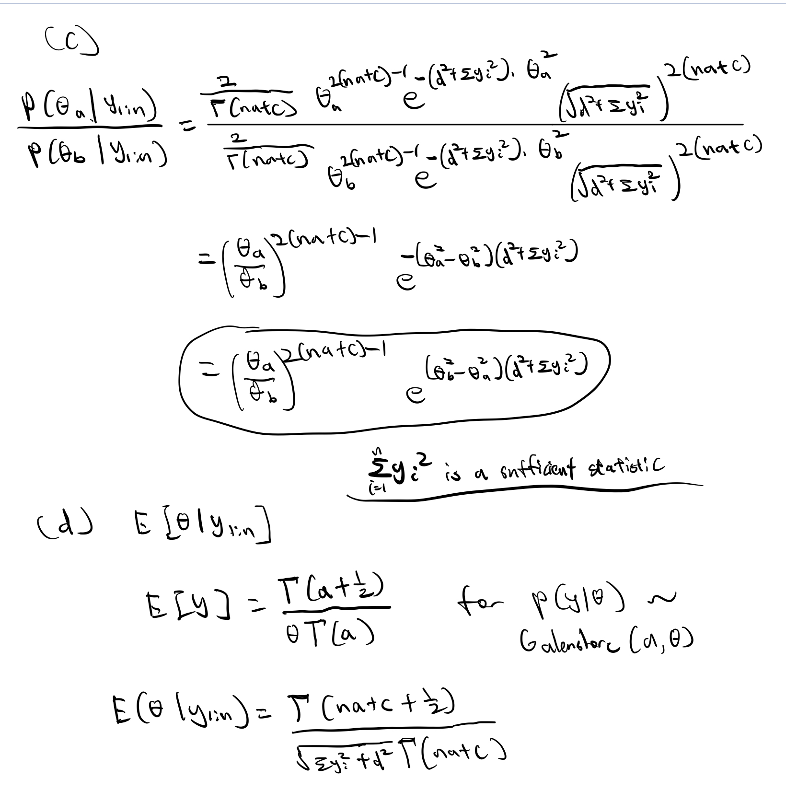

```{r setup, include=FALSE}
knitr::opts_chunk$set(echo = TRUE)
```

# LAB
Observed data: 
```{r,echo=TRUE}
# set a seed
set.seed(123)
# create the observed data
obs.data <- rbinom(n = 100, size = 1, prob = 0.01)
# # inspect the observed data
# head(obs.data)
# tail(obs.data)
# length(obs.data)
```
## Task 3

Write a function that takes as its inputs that data you simulated (or any data of the same type) and a sequence of $\theta$ values of length 1000 and produces Likelihood values based on the Binomial Likelihood. Plot your sequence and its corresponding Likelihood function.

The likelihood function is given below. Since this is a probability and is only valid over the interval from $[0, 1]$ we generate a sequence over that interval of length 1000.

You have a rough sketch of what you should do for this part of the assignment. Try this out in lab on your own. 

```{r, echo = TRUE}
### Bernoulli LH Function ###
# Input: obs.data, theta
# Output: bernoulli likelihood
LH.func = function(obs.data,theta){
  x = sum(obs.data)
  N = length(obs.data)
  LH = (theta^x)*(1-theta)^{N-x}
  return(LH)
}


### Plot LH for a grid of theta values ###
# Create the grid #
theta.sim = seq(0,1,length.out=1000)
# Store the LH values
LH.sim = LH.func(obs.data,theta.sim)
# Create the Plot
plot(x=theta.sim,y=LH.sim,type='l',main='Likelihood Profile',
     xlab="Simulated Support of Theta",ylab='Likelihood')
```

## Task 4 (To be completed for homework)

Write a function that takes as its inputs  prior parameters \textsf{a} and \textsf{b} for the Beta-Bernoulli model and the observed data, and produces the posterior parameters you need for the model. \textbf{Generate and print} the posterior parameters for a non-informative prior i.e. \textsf{(a,b) = (1,1)} and for an informative case \textsf{(a,b) = (3,1)}}.

```{r}
#Function for posterior parameters 
PostPram.func = function(a,b,obs.data){
  x = sum(obs.data)
  N = length(obs.data)
  Post.a = x + a
  Post.b = N - x + b
  ret = list("a" = Post.a, "b" = Post.b)
  return(ret)
}

##Generate and Print Posterior Parameters
#Case 1: non-informative prior 
Pram.NonInf = PostPram.func(1,1,obs.data)
Pram.NonInf
```

Posterior Parameters for non-informative prior: a = 2, b = 100

```{r}
#Case 2: informative prior 
Pram.Info = PostPram.func(3,1,obs.data)
Pram.Info
```

Posterior Parameters for informative prior: a = 4, b = 100

## Task 5 (To be completed for homework)

Create two plots, one for the informative and one for the non-informative case to show the posterior distribution and superimpose the prior distributions on each along with the likelihood. What do you see? Remember to turn the y-axis ticks off since superimposing may make the scale non-sense.


```{r}
#create support
p = seq(0,1, length=1000)

##plot Non-Informative Prior and Posterior along with likelihood
#plot posterior
plot(p, dbeta(p, Pram.NonInf$a,Pram.NonInf$b),lwd=4, ylab='density', 
     type ='l', col='yellow', main = "Non-Informative Prior", xlab = "theta", yaxt='n')
par(new=TRUE)
#plot prior
plot(p, dbeta(p, 1, 1), col='purple', type = 'l',ylab = "",yaxt='n',xlab="") 
par(new=TRUE)
#plot likelihood
plot(p, LH.sim, col='red', type = 'l', ylab = "",yaxt='n',xlab="") 


#add legend
legend("topright", c( "Posterior","Prior",'Likelihood'),
       lty=c(1,1,1),col=c("yellow","purple","red"))

```

```{r}
#create support
p = seq(0,1, length=1000)

#plot Informative Prior and Posterior along with likelihood
plot(p, dbeta(p, Pram.Info$a,Pram.Info$b),lwd=4, ylab='density', 
     type ='l', col='yellow', main = "Informative Prior", xlab = "theta", yaxt='n')
par(new=TRUE)
#plot prior
plot(p, dbeta(p, 3, 1), col='purple', type = 'l',ylab = "",yaxt='n',xlab="") 
par(new=TRUE)
#plot likelihood
plot(p, LH.sim, col='red', type = 'l', ylab = "",yaxt='n',xlab="") 


#add legend
legend("topright", c( "Posterior","Prior",'Likelihood'),lty=c(1,1,1),
       col=c("yellow","purple","red"))
```

Observation: 
The non-informative prior produced a posterior that is the same as the likelihood while the skewed informative prior created a posterior that is different from the likelihood, in the same direction as the prior's skewness. This is due to the fact that with an uninformative prior, our best estimation is still the likelihood function (the posterior).


# 2
## A, B


## B continued: 
Condition: (Given that both parameters of the Gamma distribution are greater than 0), the posterior distribution integrates to 1. 

## C
```{r}
#define data and support
obs.data = c(20.9, 69.7, 3.6, 21.8, 21.4, 0.4, 6.7, 10.0)
theta.sim = seq(0,1, length=1000)

#plotting function 
plot.func = function(a,b,theta,obs.data){
  x = sum(obs.data) #get x (sum of observed)
  n = length(obs.data) # get n (number of observed)
  prior = dgamma(theta,a,b) 
  posterior = dgamma(theta,n+a,b+x)
  
#plot posterior
plot(theta,posterior,lwd=2, ylab='density', type ='l', col='red', 
     main = "Prior and Posterior Gamma Distribution", xlab = "theta", ylim = c(0,50))
#plot prior
lines(theta, prior,lwd=2, col='purple', type = 'l',ylab = "",xlab="") 

legend("topright", c( "Posterior","Prior"), lty=c(1,1), lwd=c(3,3),
col = c("red", "purple"))
}

plot.func(0.1, 1.0,theta.sim,obs.data)

```
## D

An appropriate way to apply the exponential distribution is to model occurrences of hurricanes. If we can roughly approximate the occurrences of hurricanes as a process in which events occur continuously and independently at a constant average rate, then we can use the exponential model to predict time between hurricanes. 

Exponential distributions should not be used to predict the proportion of votes a certain candidate would receive/probability of the candidate winning or the number of heads that come up after flipping a coin certain number of times as they are binary outcomes that are more appropriately modeled with Binomial/Bernoulli distributions. 

# 3
## A
A class of conjugate prior densities for $\theta$ also belong to the Galenshore family. Given that prior parameters are (c,d): (1,1), (2,1), (2,3), (4,2)
```{r}
galenshore.func <- function(a, theta, y){
  p <- 2/gamma(a)*theta^(2*a)*y^(2*a-1)*exp(-theta^2*y^2)
  return(p)
}
y <- seq(0, 5, length.out = 100)
first <- galenshore.func(1,1, y)
second <- galenshore.func(2,1,y)
third <- galenshore.func(2,3,y) # type = "galenshore(2,3)")
fourth <- galenshore.func(4,2,y) #type = "galenshore(4,2)")


plot(y, third, type = "l", xlab = "y", ylab = "Density",
     main = "Galenshore Priors",col = "green")
lines(y, second, col = "purple")
lines(y, fourth, col = "blue")
lines(y, first, col = "red")
legend("topright", c( "Galenshore(1,1)","Galenshore(2,1)","Galenshore(2,3)","Galenshore(4,2)"), 
       lty=c(1,1), lwd=c(3,3),
col = c("red", "purple","green","blue"))

```

## B



## C,D 


## E 

